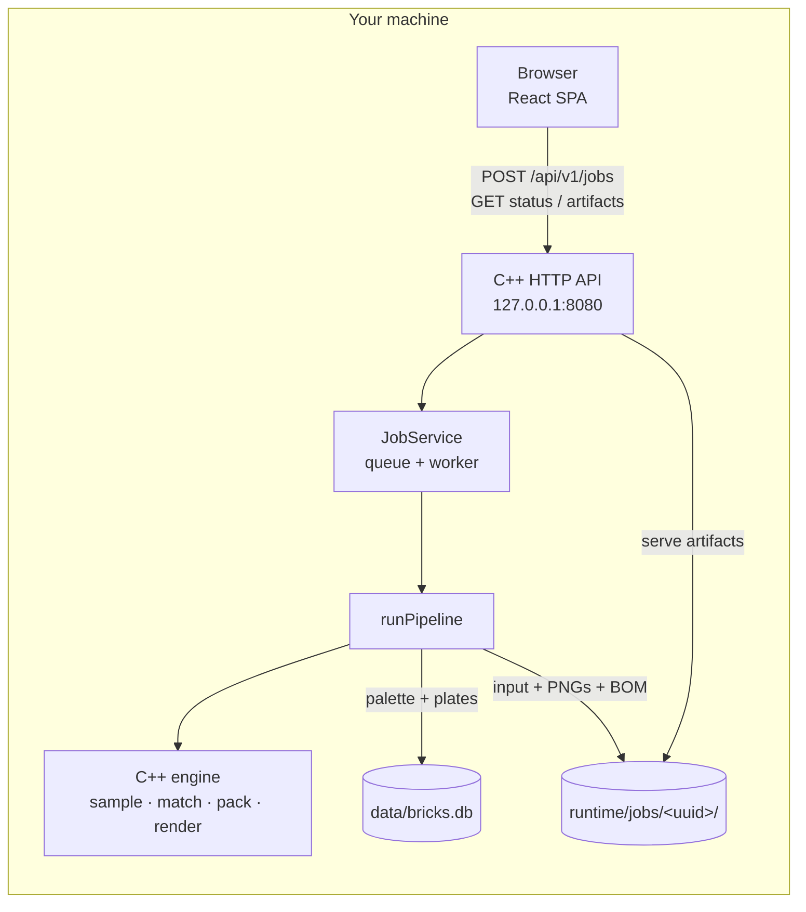
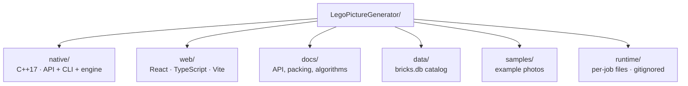
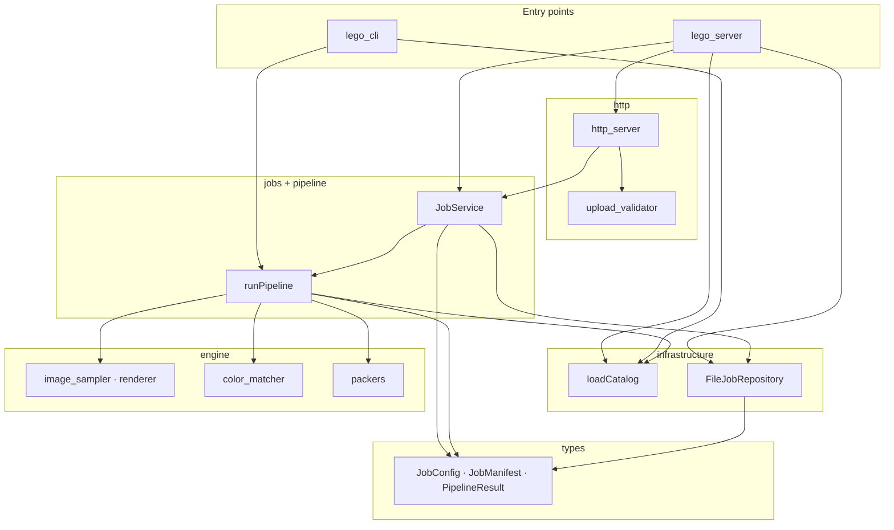
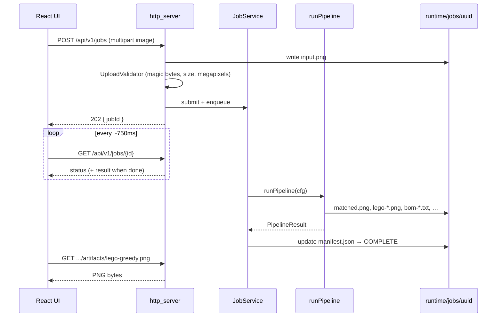
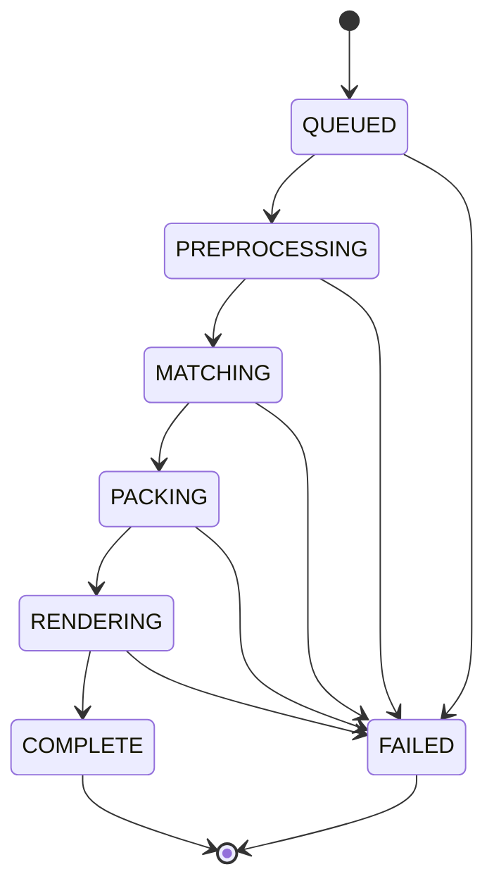
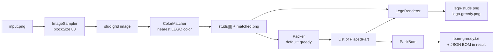
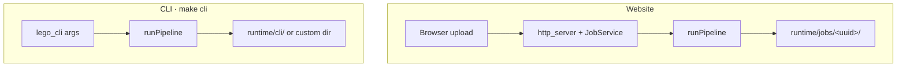

# Architecture

Local-first LEGO mosaic app: a **C++** host owns the HTTP API, job system,
catalog, and mosaic engine (`native/`); a **React** SPA is the UI. Everything
runs on your machine (`127.0.0.1`).

Deeper ops notes (safety table, retention, env vars): [`docs/architecture.md`](docs/architecture.md).  
HTTP contract: [`docs/api.md`](docs/api.md).

---

## System overview



Production (`make start`): one C++ process serves both `/api/*` and the built `web/dist` UI.  
Development: Vite on `:5173` proxies `/api` → `lego_server` on `:8080`.

---

## Repository layout



| Path | Role |
|------|------|
| `native/` | HTTP host, jobs, CLI, mosaic engine (see [`docs/native.md`](docs/native.md)) |
| `web/` | Upload UI, progress, previews, BOM table |
| `docs/` | Long-form docs and algorithm walkthroughs |
| `data/bricks.db` | Rebrickable-derived color + part availability |
| `runtime/jobs/` | Uploads and outputs for web jobs |

---

## Host layers

Dependencies point **downward only**. HTTP never lives inside packing math; the CLI reuses the same pipeline.



| Unit | Responsibility |
|---------|----------------|
| `http_server` | Routes, Host check, JSON errors, SPA files |
| `JobService` | Queue, timeouts, piece-target search |
| `runPipeline` | One full mosaic run + artifact writes |
| `FileJobRepository` | Job folders + atomic manifests + retention |
| `loadCatalog` | Palette + plate footprints from `bricks.db` |
| `image_sampler` / `color_matcher` / `packers` / `renderer` | Engine (same logic as the original Java) |
| `lego_cli` | Same pipeline, no server |

---

## Request lifecycle (website)



Job status machine:



Guards worth knowing:

- Queue capacity **8** → HTTP **429** when full
- Per-job timeout **120s**
- Restart marks in-flight jobs **FAILED** (never resume half-done work)
- Artifact URLs only serve filenames listed in that job’s manifest

---

## Pipeline (photo → mosaic)

Fixed for now: **`blockSize = 80`** (legacy CLI `BLOCK_SIZE`) — each 80×80 pixel block becomes one stud.



Web UI defaults to **greedy**; compare-all and other modes are selectable. **Aim for N pieces** forces **DLX** with a multi-probe search. Algorithm detail: [`docs/algorithm-walkthrough.md`](docs/algorithm-walkthrough.md) · [`docs/sizing/MATH.md`](docs/sizing/MATH.md).

---

## Website vs CLI



Same engine (`runPipeline` + packers). The website adds validation, a queue, polling, and artifact URLs.

---

## Per-job storage

```text
runtime/jobs/<uuid>/
  manifest.json           status, settings, PipelineResult, artifact map
  input.png               original upload
  matched.png             flat color-matched grid
  lego-studs.png          every stud as 1×1
  lego-greedy.png         packed plates
  bom-greedy.txt          shopping list
  placements-greedy.json  every plate (x, y, w, h, part, color)
  color-counts.txt        per-color stud tallies
```

`manifest.json` is written atomically (temp file + rename). Retention: completed jobs older than 7 days, or past 50 jobs / ~2 GB, are evicted oldest-first.

---

## Where to change things

| Goal | Start here |
|------|------------|
| HTTP / upload rules | `native/src/http_server.cpp`, `upload_validator.cpp` |
| Queue / timeout | `native/src/jobs.cpp` |
| Mosaic steps | `native/src/pipeline.cpp` |
| Engine / CUDA next | `native/` · [`docs/native.md`](docs/native.md) |
| Block size default | `native/include/lego/types.hpp` |
| Color matching | `native/src/color_matcher.cpp` + `catalog.cpp` |
| Packing | `native/src/packers.cpp` |
| Preview look | `native/src/renderer.cpp` |
| UI pages | `web/src/pages/`, `web/src/styles/app.css` |

---

## Related docs

- [`README.md`](README.md) — how to run
- [`docs/architecture.md`](docs/architecture.md) — safety, retention, config
- [`docs/api.md`](docs/api.md) — endpoints
- [`docs/image.md`](docs/image.md) · [`docs/color.md`](docs/color.md) · [`docs/packing.md`](docs/packing.md)
- [`docs/MATH.md`](docs/MATH.md) — formula index (sampling, color, sizing, packing)
- [`docs/native.md`](docs/native.md) — C++ engine and host
