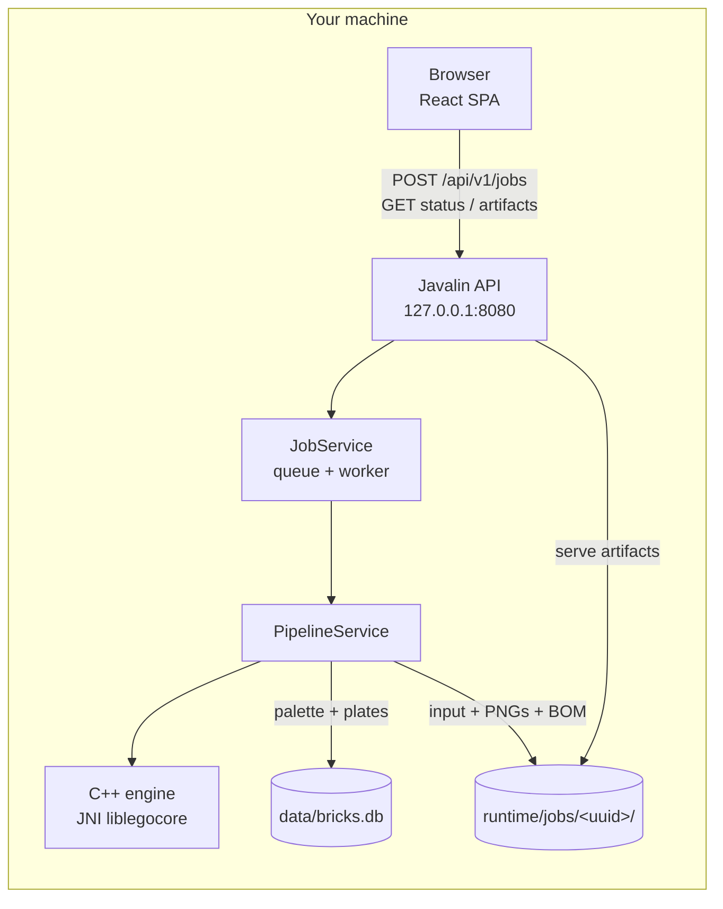
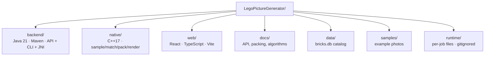
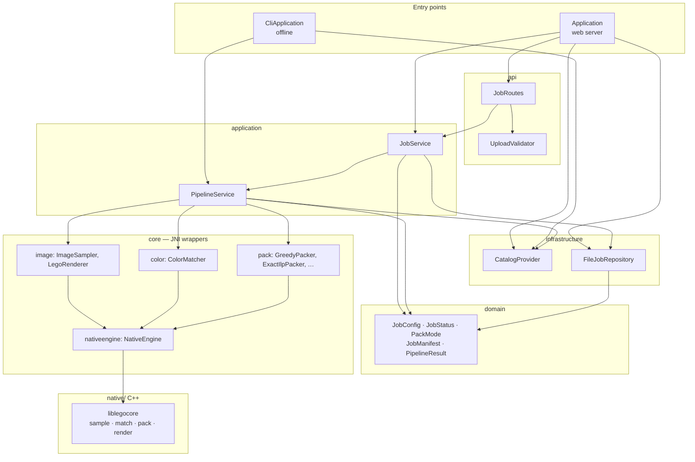
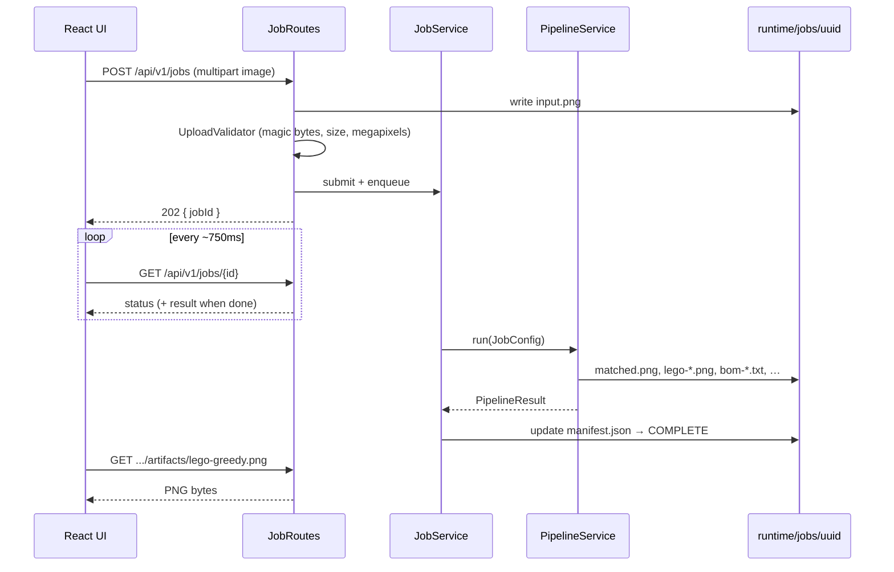
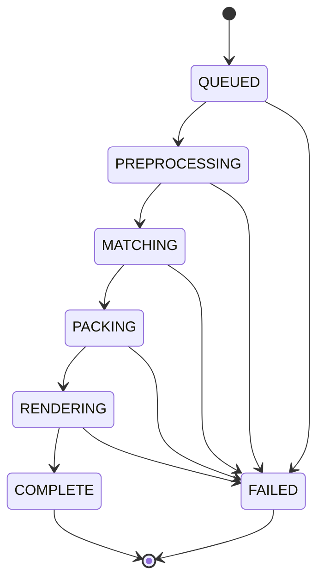
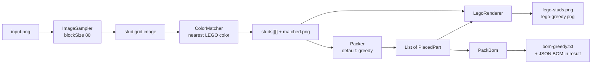
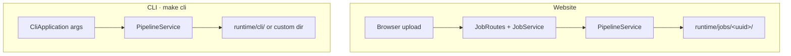

# Architecture

Local-first LEGO mosaic app: a **Java** host owns the HTTP API and job system;
a **C++** engine (`native/`, JNI) runs sampling, matching, packing, and
rendering; a **React** SPA is the UI. Everything runs on your machine (`127.0.0.1`).

Deeper ops notes (safety table, retention, env vars): [`docs/architecture.md`](docs/architecture.md).  
HTTP contract: [`docs/api.md`](docs/api.md).

---

## System overview



Production (`make start`): one Java process serves both `/api/*` and the built `web/dist` UI.  
Development: Vite on `:5173` proxies `/api` → the Java backend on `:8080`.

---

## Repository layout



| Path | Role |
|------|------|
| `backend/` | Job system, Javalin API, CLI, JNI wrappers around the engine |
| `native/` | C++ mosaic engine (see [`docs/native.md`](docs/native.md)) |
| `web/` | Upload UI, progress, previews, BOM table |
| `docs/` | Long-form docs and algorithm walkthroughs |
| `data/bricks.db` | Rebrickable-derived color + part availability |
| `runtime/jobs/` | Uploads and outputs for web jobs |

---

## Backend layers

Dependencies point **downward only**. HTTP never lives inside packing math; the CLI reuses the same pipeline.



| Package | Responsibility |
|---------|----------------|
| `api` | HTTP routes, upload validation, JSON responses |
| `application` | Job queue/timeouts; one full mosaic run |
| `infrastructure` | Load `bricks.db` once; job folders + manifests |
| `domain` | Shared types (no I/O) |
| `core.*` | Java wrappers: sampling, color match, pack, render |
| `core.nativeengine` | JNI load + calls into `liblegocore` |
| `native/` (C++) | Algorithm implementations — same logic as the original Java |
| `cli` | Same `PipelineService`, no server |

---

## Request lifecycle (website)



Job status machine:



Guards worth knowing:

- Queue capacity **8** → HTTP **429** when full
- Per-job timeout **120s**
- Restart marks in-flight jobs **FAILED** (never resume half-done work)
- Artifact URLs only serve filenames listed in that job’s manifest

---

## Pipeline (photo → mosaic)

Fixed for now: **`blockSize = 80`** (legacy CLI `BLOCK_SIZE`) — each 80×80 pixel block becomes one stud.



Web UI defaults to **greedy**; compare-all and other modes are selectable. **Aim for N pieces** forces **DLX** with a multi-probe search. Algorithm detail: [`docs/algorithm-walkthrough.md`](docs/algorithm-walkthrough.md) · [`docs/sizing/MATH.md`](docs/sizing/MATH.md).

---

## Website vs CLI



Same engine (`PipelineService` + `core.*`). The website adds validation, a queue, polling, and artifact URLs.

---

## Per-job storage

```text
runtime/jobs/<uuid>/
  manifest.json           status, settings, PipelineResult, artifact map
  input.png               original upload
  matched.png             flat color-matched grid
  lego-studs.png          every stud as 1×1
  lego-greedy.png         packed plates
  bom-greedy.txt          shopping list
  placements-greedy.json  every plate (x, y, w, h, part, color)
  color-counts.txt        per-color stud tallies
```

`manifest.json` is written atomically (temp file + rename). Retention: completed jobs older than 7 days, or past 50 jobs / ~2 GB, are evicted oldest-first.

---

## Where to change things

| Goal | Start here |
|------|------------|
| HTTP / upload rules | `backend/.../api/JobRoutes.java`, `UploadValidator.java` |
| Queue / timeout | `backend/.../application/JobService.java` |
| Mosaic steps | `backend/.../application/PipelineService.java` |
| C++ engine / CUDA next | `native/` · [`docs/native.md`](docs/native.md) |
| Block size default | `domain/JobConfig.DEFAULT_BLOCK_SIZE` |
| Color matching | `core/color/ColorMatcher.java` |
| Packing | `core/pack/*Packer.java` |
| Preview look | `core/image/LegoRenderer.java` |
| UI pages | `web/src/pages/`, `web/src/styles/app.css` |

---

## Related docs

- [`README.md`](README.md) — how to run
- [`docs/architecture.md`](docs/architecture.md) — safety, retention, config
- [`docs/api.md`](docs/api.md) — endpoints
- [`docs/image.md`](docs/image.md) · [`docs/color.md`](docs/color.md) · [`docs/packing.md`](docs/packing.md)
- [`docs/MATH.md`](docs/MATH.md) — formula index (sampling, color, sizing, packing)
- [`docs/native.md`](docs/native.md) — C++ engine and JNI
