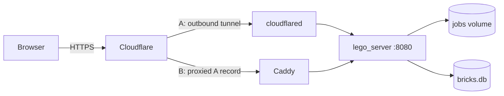

# Deploying as a public website

Two supported setups. Both run the same container image; only the thing in
front of it changes.

| Path | Where it runs | HTTPS by | Open ports on your network | Cost |
|------|---------------|----------|----------------------------|------|
| **A. Home PC + Cloudflare Tunnel** | Your own Windows / Mac / Linux box | Cloudflare | None | $0 |
| **B. VM + Caddy** | Oracle Always Free A1, Hetzner, any VPS | Caddy (Let's Encrypt) | 80, 443 | $0–5/mo |

Path A is up whenever the PC is on. Path B is always on.

Prerequisite for both: a domain whose DNS is on Cloudflare (buying it through
Cloudflare Registrar is the simplest way).



`lego_server` never publishes a port. Only `cloudflared` (A) or `caddy` (B)
can reach it, over the private Docker network.

---

## What the app does differently when hosted

Set through environment variables; `docker-compose.yml` sets all of them.

| Variable | Local default | Hosted value | Why |
|----------|---------------|--------------|-----|
| `LEGO_BIND` | `127.0.0.1` | `0.0.0.0` | Other containers must reach it |
| `LEGO_ALLOWED_HOSTS` | `localhost,127.0.0.1` | your domain | DNS-rebinding guard; any other `Host` gets 403 |
| `LEGO_TRUST_PROXY` | `0` | `1` | Read the visitor IP from `CF-Connecting-IP` / `X-Forwarded-For` |
| `LEGO_UPLOADS_PER_MINUTE` | `0` (off) | `5` | Per-visitor cap on new jobs → 429 |
| `LEGO_WORKER_COUNT` | `1` | cores you can spare | Jobs run in parallel |

Everything else (25 MB / 25 MP caps, magic-byte checks, path-traversal
guards, 120 s job watchdog, queue of 8, 7-day retention) is the same as local.

---

## Path A: Home PC with Cloudflare Tunnel

### One-time: Cloudflare

1. Cloudflare dashboard → **Zero Trust** → **Networks** → **Tunnels** → **Create a tunnel** → **Cloudflared**.
2. Name it (e.g. `lego-pc`). On the connector page choose **Docker** and copy the long token after `--token`. You don't need to run their command.
3. **Public Hostname** tab → **Add a public hostname**:
   - Subdomain: `mosaic` (or whatever you want)
   - Domain: yours
   - Path: blank
   - Service type: **HTTP**, URL: **`app:8080`** (not `localhost`; inside Docker, `app` is the server container)
4. Save. Cloudflare creates the DNS record for you.

The tunnel shows **Down** until the container is running.

### One-time: the PC

1. Install **Docker Desktop** (Windows: the AMD64 build for Intel/AMD chips; WSL2 backend). In its settings tick **Start Docker Desktop when you sign in**.
2. Windows → Settings → System → Power: **Screen off: whenever**, **Sleep: Never** when plugged in. Also run `powercfg /hibernate off` in an admin PowerShell so updates can't put it into hibernation.
3. Install Git if you don't have it.

### Deploy

In PowerShell (or any terminal):

```powershell
git clone https://github.com/WesJennings/LegoPictureGenerator.git
cd LegoPictureGenerator
copy .env.example .env
notepad .env
```

Fill in `.env`:

```dotenv
LEGO_DOMAIN=mosaic.yourdomain.com
CLOUDFLARE_TUNNEL_TOKEN=eyJhIjoi...   # from the Cloudflare tunnel page
LEGO_WORKER_COUNT=2
LEGO_UPLOADS_PER_MINUTE=5
```

Copy `bricks.db` into `data\` (see [`../data/README.md`](../data/README.md)
if you need to build it). Then:

```powershell
docker compose --profile tunnel up -d --build
```

The first build compiles the C++ and the web UI inside Docker and takes a few
minutes. When it finishes, the tunnel flips to **Healthy** in the Cloudflare
dashboard and `https://mosaic.yourdomain.com` works.

### Day to day

```powershell
docker compose --profile tunnel logs -f        # watch
docker compose --profile tunnel ps             # status + health
git pull; docker compose --profile tunnel up -d --build   # update
docker compose --profile tunnel down           # stop
```

Both containers have `restart: unless-stopped`, so they come back after a
reboot once Docker Desktop starts.

### Notes

- Cloudflare's **SSL/TLS mode** doesn't matter for tunnels; leave it alone.
- The `cloudflared` → `app` hop is plain HTTP on a private Docker network inside your machine. Visitors are on HTTPS end to end.
- You can also reach it locally at `http://localhost:8080` only if you add a `ports:` line to `app`; by default nothing is published.

---

## Path B: VM with Caddy

### Oracle Always Free (Ampere A1)

1. **Compute → Instances → Create instance.** Image: Ubuntu 22.04 / 24.04. Shape: **Ampere → VM.Standard.A1.Flex**; 1 OCPU / 6 GB is enough, up to 4 OCPU / 24 GB is free.
   - Networking: create a new VCN *first* via **Networking → VCN Wizard → VCN with Internet Connectivity**, then in the instance form choose that VCN and its **public** subnet, and turn on **Assign a public IPv4 address**.
   - Generate an SSH key pair and **save the private key**.
   - **"Out of capacity"** is common on the free tier. Click **Save as stack** and retry **Apply** in Resource Manager later (off-peak hours help). Upgrading to **Pay As You Go** (still $0 within free limits) raises your odds a lot and also disables idle-instance reclamation. Set a $1 budget alert.
2. Open ports in Oracle: instance → subnet → **Security Lists** → **Default Security List** → **Add Ingress Rules**: source `0.0.0.0/0`, TCP, destination port `80`; again for `443`.
3. SSH in: `ssh -i ~/.ssh/oracle.key ubuntu@PUBLIC_IP`.
4. Open the same ports in the OS (Oracle images block them):

   ```bash
   sudo iptables -I INPUT 6 -m state --state NEW -p tcp --dport 80 -j ACCEPT
   sudo iptables -I INPUT 6 -m state --state NEW -p tcp --dport 443 -j ACCEPT
   sudo netfilter-persistent save
   ```

5. Install Docker:

   ```bash
   sudo apt update && sudo apt upgrade -y
   curl -fsSL https://get.docker.com | sudo sh
   sudo usermod -aG docker ubuntu
   exit   # then ssh back in
   ```

### Hetzner / DigitalOcean / other VPS

Create an Ubuntu server (Hetzner CAX11 or CX22 is plenty), add your SSH key,
open 80 and 443 in the provider's firewall, install Docker as above. No
`iptables` step needed.

### Cloudflare DNS

**DNS → Records → Add record**: Type `A`, Name `mosaic`, IPv4 = the VM's
public IP, **Proxied** on. Then **SSL/TLS → Overview → Full (strict)**.

### Deploy

```bash
git clone https://github.com/WesJennings/LegoPictureGenerator.git
cd LegoPictureGenerator
cp .env.example .env
nano .env        # LEGO_DOMAIN=mosaic.yourdomain.com ; LEGO_WORKER_COUNT=1 on a 1-OCPU shape
# copy bricks.db into data/ (scp from your laptop, or build it here)
docker compose --profile vps up -d --build
```

Caddy requests a Let's Encrypt certificate on the first visit. Update with
`git pull && docker compose --profile vps up -d --build`.

On a 1-OCPU shape the build takes several minutes. A later option is building
the image in GitHub Actions and pulling it, but it isn't needed to start.

---

## Operating either path

- **Logs:** `docker compose --profile <tunnel|vps> logs -f app`
- **Health:** `GET /api/v1/health` → `{"status":"ok","paletteColors":N}`
- **Disk:** the `jobs` volume is capped by retention (7 days / 50 jobs / ~2 GB). Nothing else grows.
- **Backups:** none needed. Code is in git, `bricks.db` is reproducible, jobs expire.
- **Slow modes:** `ilp`, `dlx`, `anneal`, and **Aim for N pieces** can run for minutes and hold the queue. If strangers abuse them, raise `LEGO_UPLOADS_PER_MINUTE` restrictions or hide those options in the UI.
- **More capacity:** raise `LEGO_WORKER_COUNT` (one per spare core) and rerun `up -d`.
- **Switching paths:** same repo, same `.env` minus/plus the tunnel token; run the other profile.

## Threat model recap

| Risk | Covered by |
|------|-----------|
| Direct access to the app port | Not published; Docker network only |
| Home IP exposure (Path A) | Tunnel is outbound; nothing listens on the LAN |
| DNS rebinding / wrong hostname | `LEGO_ALLOWED_HOSTS` → 403 |
| Upload floods | Per-IP `LEGO_UPLOADS_PER_MINUTE` → 429, plus queue cap → 429 |
| Bad image files | Magic bytes + header dimension check before decode |
| Oversized bodies | 25 MB in app; Caddy `request_body` on Path B |
| Running as root | Container runs as uid 10001 |
| Information leaks | Health endpoint no longer exposes filesystem paths; errors are generic |

More detail: [`architecture.md`](architecture.md).
